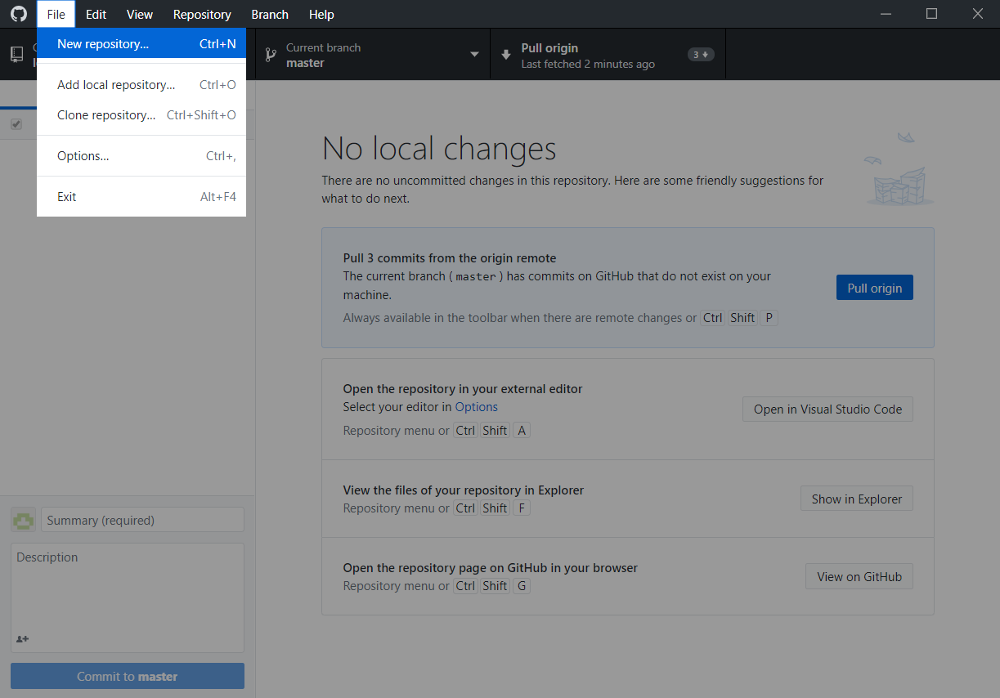

GitHub Desktop 可以很方便地管理本地和远程仓库，如果你刚刚接触 GitHub、 同时对 Git Bash 等命令行工具又很陌生的话，GitHub Desktop 就是一个非常适合的选择了。

开始学习本教程之前，需要先注册 GitHub 账号，并安装 GitHub Desktop，注册和安装过程就不过多赘述了，小伙伴们可以自行前往官网[注册账号](https://github.com/)、[下载 GitHub Desktop](https://desktop.github.com/)。

## 创建本地仓库
首先打开 GitHub Desktop，点击左上角`File`->`New repository`。

`Name`即仓库名称，由你自己决定仓库叫什么，这里我创建了一个名为`test`的仓库；`Local path`为仓库存储地址，也是由你自己选择，这里我将仓库存在了`E`盘。信息填写完毕后，点击`Create repository`。

然后打开刚刚的存储路径，（因为我刚刚存储在了`E`盘，所以打开`E`盘就行），就能看见新建的本地仓库了。

本地仓库里会自动生成一个文件`.gitattributes`文本文件，用来存储配置信息。这里我们不做教学，如果感兴趣的话可以上网搜索一下~~在初学时可以先不管这个文件，不会有任何影响。

## 提交本地改动到远程仓库
本地仓库有了任何改动，比如新建了文件、文件有了更改，又或者删除了不需要的文件，GitHub Desktop 都可以识别并显示出来，你可以选择将这些改动提交到远程仓库，即提交到云端。下面我们来做个演示：

首先，在刚刚创建的本地仓库里新建一个文件，这里我创建了一个`test.txt`文件：

然后打开 GitHub Desktop，可以看到`test.txt`文件显示在了更改里。然后简单为此次改动填写一下备注信息，如图中的`update`，点击`commit to master`。

注意，此时并没有真正将改动推送到远程仓库，还要再点击右上角的`Publish repository`后才算大功告成。

`keep this code private`是选择将库公开还是设为私密状态，一般个人的库选择公开开源的比较多。然后点击`Publish repository`。**（注：因为这是新建的本地仓库，云端没有，所以会多这一步；如果云端已经有了这个仓库，提交改动时就不会有这一步了。）**

此时，到自己的 [GitHub 主页](https://github.com/)可以查看到最新推送上去的仓库。

## 克隆远程仓库到本地
`Clone`可以简单地理解为将储存在云端、同时本地又没有的远程仓库下载到本地。方法为：打开 GitHub Desktop，点击`File`->`Clone repository`。

选择想要克隆的仓库，并填好存储地址。这里我选择克隆提前建立好的名为`test2`的仓库，存在`E`盘，然后点击`Clone`。克隆完成后，打开`E`盘即可看见刚刚克隆到本地的`test`仓库。

## 拉取远程改动到本地仓库
如果在远程仓库更新了东西，但是还没有同步到本地仓库，也可以用 GitHub Desktop 进行拉取同步。

在`Cureent repository`选择你想要同步的仓库，点击右上角`Fetch origin`。

如果远程仓库有更新的话，会显示出来，如下图，点击`Pull origin`即可将远程更新的内容下载到本地。

