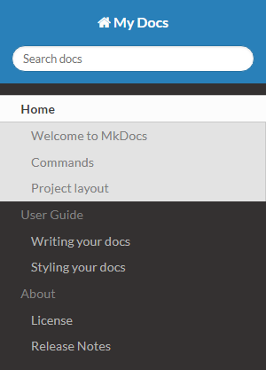

# 文档布局

## 初始结构

在项目文件夹中，初始文档包括：

- `docs`文件夹：其中存放着 `Markdown` 格式的 `mkdocs` 文档。

- `mkdocs.yml` ：项目的配置文件。

生成`mkdocs`项目后，会生成一个最简单的目录结构:

``` .
$ tree
.
├── docs
│   └──index.md
└── mkdocs.yml
```

 `index` 即为默认的项目主页。

## 设置多级目录

我们也可以根据需要生成多级目录，多级目录也要在 `mkdocs.yml` 中配置。多级目录的语法格式如下：

```
- [一级目录名称]:
    - [子目录名称]:[文件路径/文件名.md]
    ...
```

注意：其中 `[子目录名称]` 可以省略，如果省略，那么当前页面名称即显示为该 `markdown` 文件的一级标题。

示例：

```nav:
- Home: index.md
- User Guide:
    - Writing your docs: user-guide/writing-your-docs.md
    - Styling your docs: user-guide/styling-your-docs.md
- About:
    - License: about/license.md
    - Release Notes: about/release-notes.md
```

如果采用的 `readthedocs` 主题，那么效果如下：



这样一个多级目录就生成了！在该主题下，一级目录 `Home` 、 `User Guide` 、 `About` 也变为了不可选中状态。
