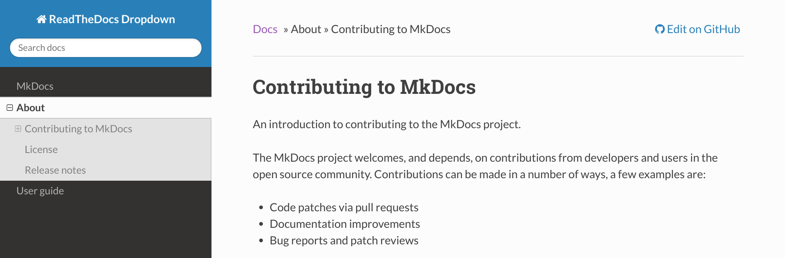
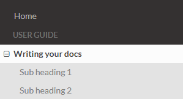
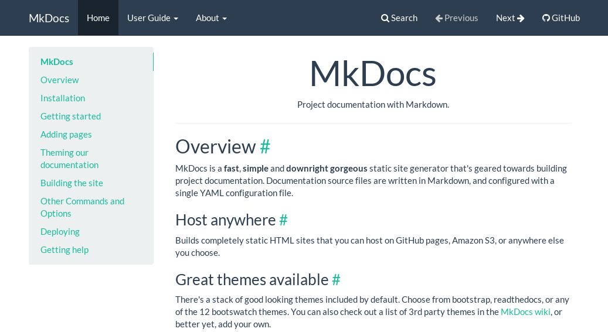
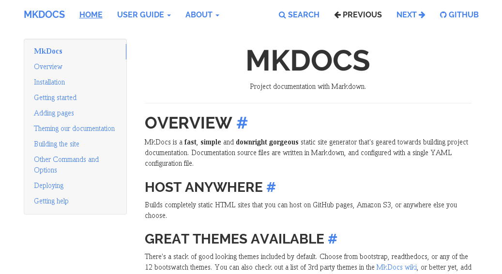
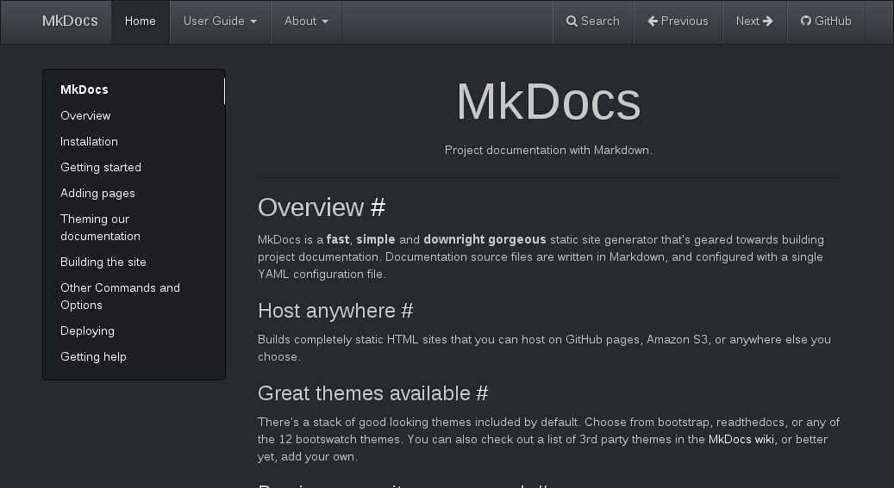
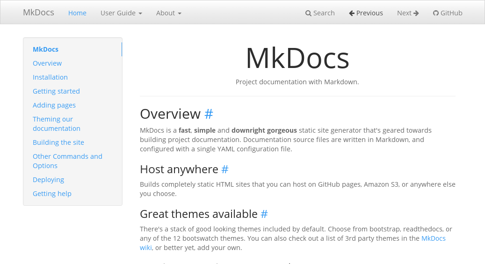
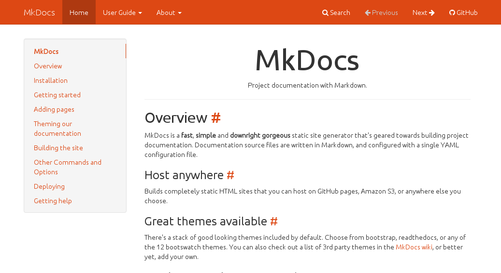

[TOC]

## 更改主题

更改主题的语法格式为 `theme: [主题名]` 。

如果把主题更换为 `readthedocs` ，可以在 `mkdocs.yml` 文件中添加：

 ```
 theme: readthedocs
 ```

## 内置主题

`MkDocs` 自己内置了两个主题，分别是 `mkdocs` 和 `reathedocs` 。此外，我们也可以使用一些第三方主题。

### mkdocs

 `mkdocs` 是创建项目后，项目默认使用的主题，使用修改过的Bootstrap构建而成，支持MkDocs的大部分功能。官方只支持两级导航。


### readthedocs

该主题来源于Read the Docs服务使用的默认主题，也仅支持两个级别的导航。


## 第三方主题

`MkDocs` 项目托管在 github 上，在项目的 `community wiki` 中，提供了大量的[第三方主题](https://github.com/mkdocs/mkdocs/wiki/MkDocs-Themes)。

### [ReadTheDocs-Dropdown](https://github.com/cjsheets/mkdocs-rtd-dropdown)

<br>



#### 安装 & 使用

```
pip install mkdocs-rtd-dropdown
```

在 `mkdocs.yml` 中配置：

```
theme: rtd-dropdown
```

这个主题在 `mkdocs` 中的名称为 `rtd-dropdown` 。

为什么要着重强调一下这个主题呢，因为这个主题非常好用，是内置主题 readthedocs 的升级版，相比于之前的版本，升级版的主题有以下几个优点：

+ 支持菜单目录折叠。如图所示，点击 `+` 可以展开，展开后会显示下一级的所有标题，如果还有下一级标题中还有子标题，则会嵌套显示 `+` 。

+ `rtd-dropdown` 主题取消了子目录的缩进，防止目录级别过多而导致排版出现问题。

+ 对应的 `markdown` 文档只存在一个一级标题的情况下，将不予显示在导航目录中。
  
  在之前版本的 `read the docs` 主题中， `子目录` 所在 `markdown` 文档的一级标题会显示在 `子目录` 的 `下一级目录` 中，这就导致了`子目录` 和 `下一级目录` 重复的情况出现。而 `rtd-dropdown` 主题则解决了这一问题。  
  <br>
  
  为了更好的说明这个情况，我们看一下前后的对比：
  <br>

  > reathedocs

  
  <br>
  > rtd-dropdown<br>

  

注：本文中所指的导航栏、导航目录、菜单栏、菜单目录等均为同一事物。

### [Bootswatch](https://mkdocs.github.io/mkdocs-bootswatch/)

[Bootswatch 项目](https://github.com/mkdocs/mkdocs-bootswatch)提供了基于 Bootstrap 的各种 MkDocs 主题。

#### 安装 & 使用

```
pip install mkdocs-bootswatch
```

Bootswatch 提供的主题列表如下：

- [amelia](#amelia)
- [cerulean](#cerulean)
- [cosmo](#cosmo)
- [cyborg](#cyborg)
- [flatly](#flatly)
- [journal](#journal)
- [readable](#readable)
- [simplex](#simplex)
- [slate](#slate)
- [spacelab](#spacelab)
- [united](#united)
- [yeti](#yeti)

比如在 `mkdocs.yml` 中配置 `amelia` 主题：

```
theme: amelia
```

或

```
theme: cosmo
```

### Amelia


### Cerulean


### Cosmo


### Cyborg


### Flatly



### Journal


### Readable



### Simplex


### Slate



### Spacelab



### United



### Yeti

