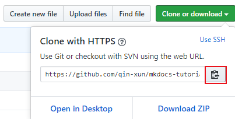
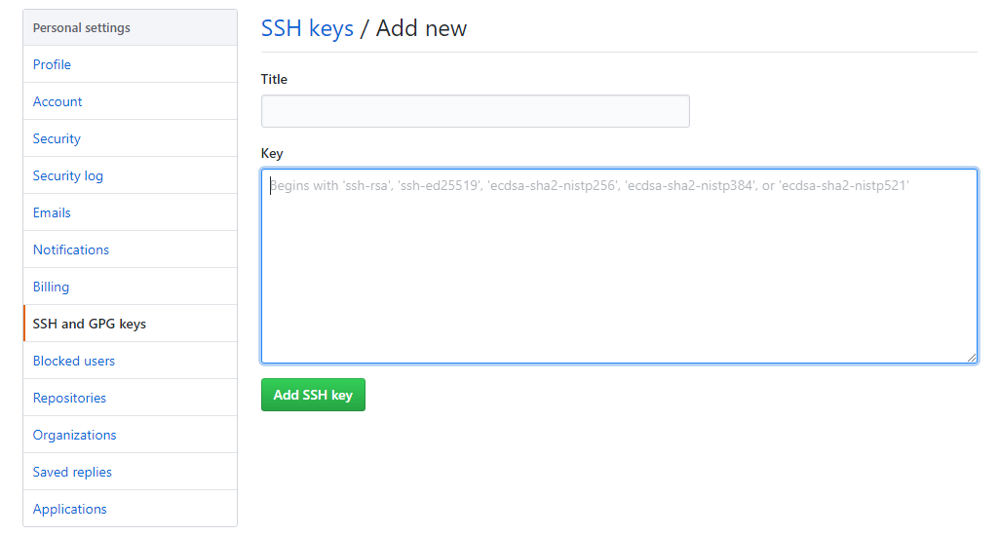

Git 是一个开源的分布式版本控制系统，因其版本控制和协同工作的特性，既可以托管代码，也可以托管文档。

那么 Git 和 Github 的区别是什么呢？

Git 是软件，它可在本地建立仓库，也可以在公司服务器、Github 服务器上建立仓库。

Github 是采用了 Git 作为版本控制系统的网上代码托管平台。因此 Github 可以托管各种 Git 库，并提供一个 Web 界面，以可视化的形式记录个人和项目的历史。

Git 相关知识推荐读者自行前往 [菜鸟教程](https://www.runoob.com/git/git-tutorial.html) 学习，读者需要了解 [Git 工作区、暂存区和版本库](https://www.runoob.com/git/git-workspace-index-repo.html) 的相关知识，此教程只介绍 Git 相关命令。

## Git 安装配置

Git 支持 Linux、Solaris、Mac和 Windows 平台上运行。下载地址：

<https://git-scm.com/downloads>

本文以 Windows 平台为例讲解各项命令。

## Git 使用

Git 安装包自带 `Git Bash` （Git 命令行） 和 `Git GUI` （Git 图形界面），在当前项目文件夹空白处右击，会出现相关选项：


在我的电脑上，`Git Bash` 有些许 bug ， 因此不推荐大家使用。

如上图所示，可以自行安装 `Cmder` （<https://cmder.net/）。>

`Cmder` 是一个增强的命令行工具，不仅可以使用windows下的所有命令，还可以使用linux的命令和shell命令。

不过在这里笔者推荐使用 Windows 系统自带的命令行工具（cmd），快速打开当前文件夹路径的 cmd 方法如下：

- 进入项目文件夹，点击该项目文件夹的路径，即会选中当前路径

- 输入 cmd ，按回车键，即可打开


## Git 基本命令

### 克隆仓库

如果想克隆远程仓库至本地，我们需要知道远程仓库的地址，以本项目为例，本项目的 https 地址为 https://github.com/qin-xun/mkdocs-tutorial，进入该页面后，我们点击 `Clone or download` ，点击 `复制` icon，获得该 `git` 库的地址。



随后在 cmd 中输入克隆命令：

```
git clone [ git 仓库路径]
```

### 创建仓库

我们也可以在本地创建仓库，在合适位置新建文件夹，进入该文件夹，输入：

```
git init # 初始化版本库
```

即可创建本地仓库，这时候文件夹内会生成一个 `.git` 文件夹，这个文件夹是一个目录， Git 用它来跟踪、管理版本，不可随意改动。

本地仓库一开始是没有和远程仓库关联的，我们还需要关联远程库。

### 关联远程库

关联远程库当然需要关联你的 Github 帐号，与账号的关联通过 SSK Key 来实现，也就是要把公钥放到git服务器上，这样才有权限进行代码推送。

要生成 SSH 公钥，在当前文件夹下的 cmd 中输入：

```
ssh-keygen -t rsa -C "[你在 github 上注册时的邮箱]"

注意：英文状态下的 `"` ， 不可省略。
```

按 `Enter` 后，会在 `C:\Users\Administrator\.ssh` 下生成一个 `id_rsa.pub` 文件，这里面记载的是我们的 SSH 公钥。

我们用记事本打开，复制里面的内容。

登录 Github ，点击 右上角账户头像 - Settings - SSH and GPG Keys - New SSH Key ：


粘贴我们刚才复制的 SSH 公钥：



测试ssh key是否成功，输入：

```
ssh -T git@github.com
yes
```

如果出现
```
You’ve successfully authenticated, but GitHub does not provide shell access.
```

这就表明已成功连上 GitHub 。

之后，我们可以使用如下命令，把本地仓库和远程仓库关联起来：

```
git remote add origin https://github.com/your-username/your-repo.git
```

### 添加内容并推送到远程

命令如下：

```
git add . # 添加文件到版本库（只是添加到缓存区），.代表添加文件夹下所有文件
git commit -m "[what you've done]" # 提交到版本库，引号内为提交的备注，可以写你所做的工作
git push -u origin master # 推送到远程库的 master 分支
```

由于远程库是空的，我们第一次推送 `master` 分支时，加上了-u参数，这样会把本地的 `master` 分支和远程的 `master` 分支关联起来，在以后的推送或者拉取时，就可以省略掉 `-u` ，简化命令。

## Git 其他命令

- 查看远程仓库 `git remote -v`
<br>
- 远端抓取 `git fetch`
- 与本地当前branch合并 `git merge origin master`
- 把远程库更新到本地 `git pull origin master` # 相当于
<br>
- 比较远程更新和本地版本库的差异 `git log master.. origin master`

- 想要在github上面删除，但又不想在本地删除文件
`git rm -r --cached .idea  #--cached 不会把本地的.idea删除`
`git commit -m 'delete .idea dir'`
`git push -u origin master`

- 在仓库的当前分支（一般为 master ）下新建分支并切换到新建分支 `git checkout -b new-branch`

- 把本地的新分支推送到远程仓库并新建分支，并为远程的新建分支命名 `git push origin [name-of-local-new-branch]:[name-of-remote-new-branch]`

- 取消本地目录下关联的远程库 `git remote remove origin`

注意： `origin` 统一指代远程仓库
