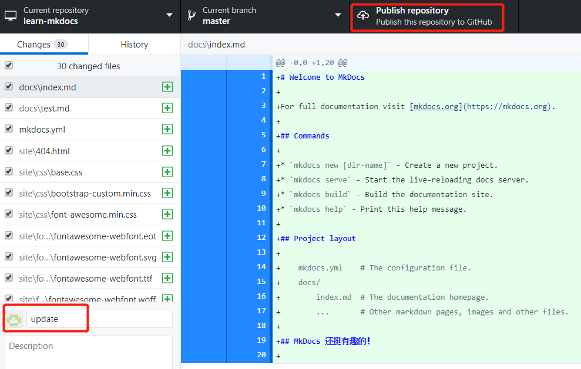
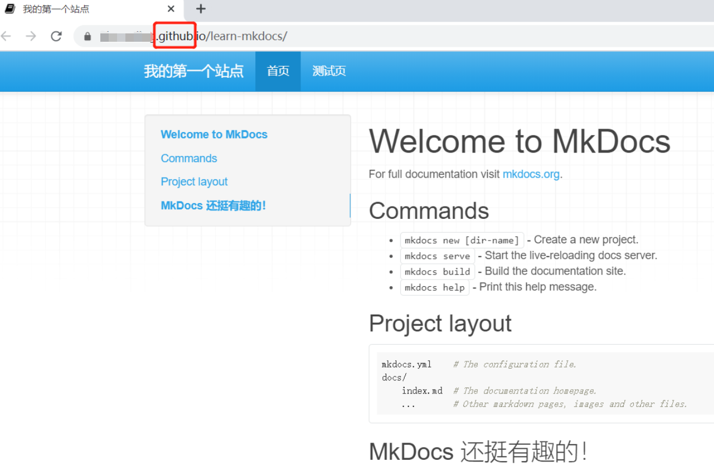

# 使用 Github Pages 发布
这里将使用 GitHub Desktop 做演示，电脑里没有 GitHub Desktop 的小伙伴可以[点此](https://desktop.github.com/)自行下载。

首先，我们新建一个仓库，`Name`为`learn-mkdocs`，`Local path`为仓库存储路径：

然后，将`my-poject`中的所有文件全部复制到`learn-mkdocs`里：

这时 GitHub Desktop 会显示出文件夹的更改，点击`Publish repository`将文件夹内容推送到 GitHub 云端，这里我选择了将仓库公开：

然后仓库就成功推送到云端了，如果此时你查看自己网页版的 GitHub 页面，是可以看到新建的`learn-mkdocs`仓库的。

下面就是最后一步了，在`learn-mkdocs`路径下，打开命令提示符，执行`mkdocs gh-deploy`命令，成功之后，会生成一个网址，打开那个网址就可以看到你自己编写的网站啦~

从下图可以看出，这里已经不是本地地址了，整个站点已经托管到了 GitHub 上了~至此，你已经学会了搭建并发布属于自己的站点了，恭喜鸭！

# 使用 Read the Docs 发布

使用 Read the Docs 发布前，请确保`theme`为`readthedocs`，不然可能无法成功构建网页。如果不了解如何设置`theme`，可以在`MkDocs 进阶操作->主题配置`里学习。如果`theme`设置没有问题，就请继续往下看吧。

首先使用自己的 GitHub 账号注册 Read the Docs 账号，然后选择`Import a Project`。

在导入代码库时，如果没有出现想要导入的库，可以点击右上角的刷新按钮，然后将库导入。

接下来，再设置项目详情时，勾选`编辑项目高级选项`，点击`下一步`。

将`文档类型`设为`Mkdocs`，`语言`设为`Chinese`。

设置完成后，点击`Build version`。

构建成功后，点击`阅读文档`就可以看到最终的成果啦！

