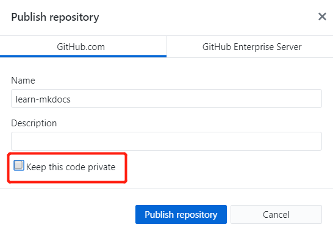

# 使用 Github Pages 发布
这里将使用 Github Desktop 做演示，电脑里没有 Github Desktop 的小伙伴可以[点此](https://desktop.github.com/)自行下载。

首先，我们新建一个仓库，`Name`为`learn-mkdocs`，`Local path`为仓库存储路径：

然后，将`my-poject`中的所有文件全部复制到`learn-mkdocs`里：

这时 Github Desktop 会显示出文件夹的更改，点击`Publish repository`将文件夹内容推送到 Github 云端，这里我选择了将仓库公开：

然后仓库就成功推送到云端了，如果此时你查看自己网页版的 Github 页面，是可以看到新建的`learn-mkdocs`仓库的。

下面就是最后一步了，在`learn-mkdocs`路径下，打开命令提示符，执行`mkdocs gh-deploy`命令，成功之后，会生成一个网址，打开那个网址就可以看到你自己编写的网站啦~

从下图可以看出，这里已经不是本地地址了，整个站点已经托管到了 Github 上了~至此，你已经学会了搭建并发布属于自己的站点了，恭喜鸭！

# readthedocs