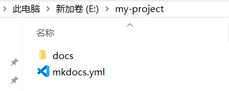
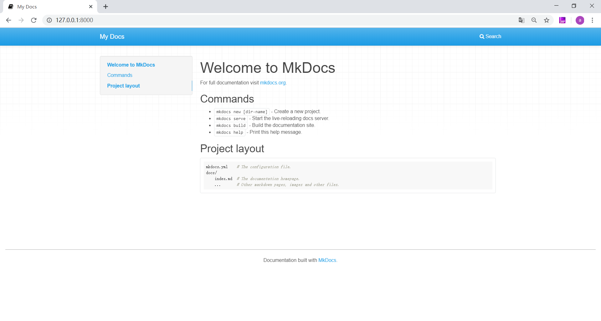
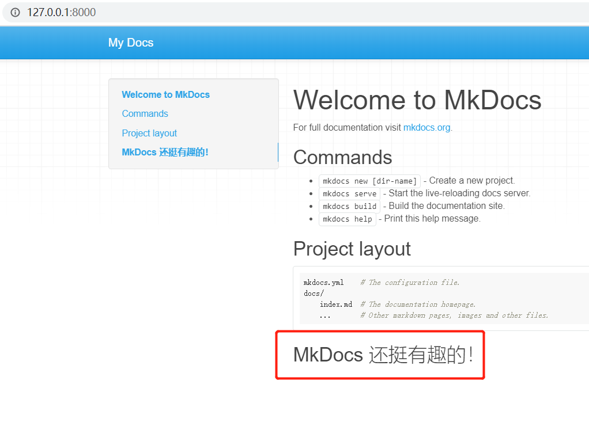
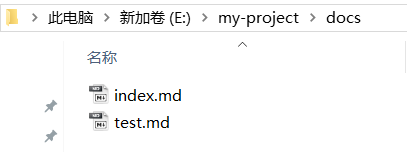
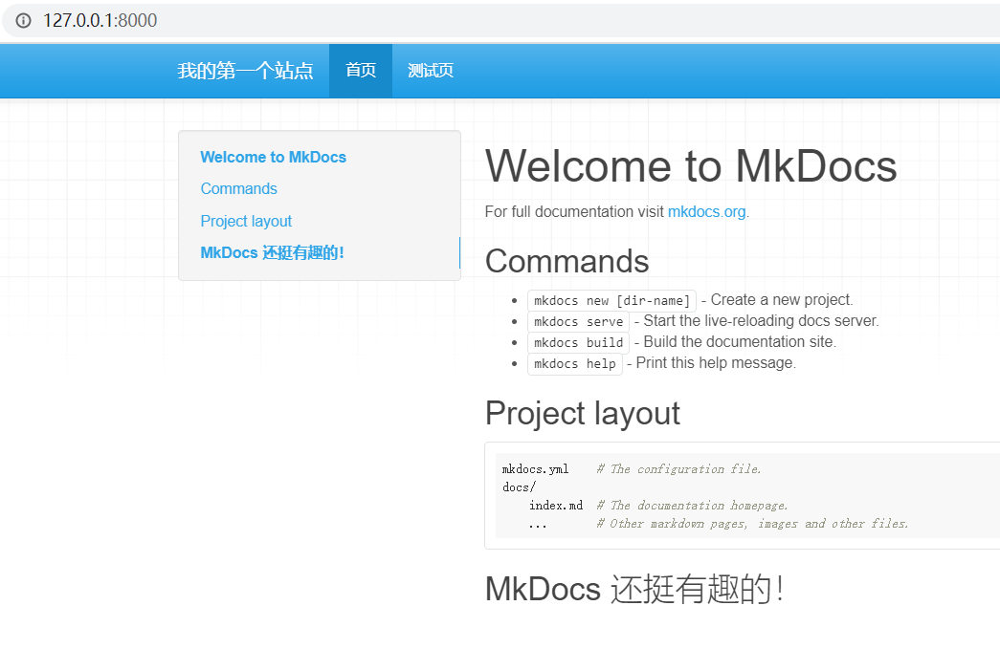

# 新建项目
首先选择好将项目文件储存在哪个磁盘，然后在该磁盘路径下执行命令。比如，想要把项目文件都放在 E 盘的话，就在 E 盘路径下执行以下命令：
```
mkdocs new my-project
```
这里的`my-project`即为你的项目名称，如果你的项目名称为`my-blog`，就可以执行`mkdocs new my-blog`命令。

结果如下：


最后生成了一个名为`my-project`的文件夹，如下图所示：



下面解释下`my-project`文件夹中每个文件的作用：

- `mkdocs.yml`：此为配置文件，文档的结构、主题都可以在此设置。
- `docs`文件夹：撰写的 Markdown 文档都放在这个文件夹内。
- `index.md`：默认首页。

到此，一个新项目就创建好了~

# 启动服务
MkDocs 包含了一个内建的服务器，可以在本地预览当前文档。在项目文件夹下打开命令提示符，执行`mkdocs serve`命令就可以启动内建服务器，比如，之前在 E 盘新建了项目`my-project`，则在`my-project`路径下执行`mkdocs serve`就行，如下图：


执行成功后，在浏览器打开 [http://127.0.0.1:8000/](http://127.0.0.1:8000/),就可以看到页面的样子啦！如下图：



此时页面上所展示的内容就是`index.md`里默认的首页内容，可以自行更改~我们来修改一下看看效果。首先在`index.md`里添加一些内容并保存，如下图：


然后 [http://127.0.0.1:8000/](http://127.0.0.1:8000/) 会自动刷新，就可以看到修改后的结果啦！



# 添加页面
现在添加第二个页面。这一步其实非常简单，只需要将你撰写好的 Markdown 文档，放到`docs`文件夹下即可。这里，我用了一个`test.md`文件作为测试，把它放在了`docs`文件夹下。



这时 [http://127.0.0.1:8000/](http://127.0.0.1:8000/) 已经自动刷新可以看见效果了：


但是这个页面还比较潦草，我们可以简单配置一下。打开`mkdocs.yml`配置文件，更改如下：
```
site_name: 我的第一个站点

nav:
  - 首页: index.md  
  - 测试页: test.md
```
`site_name`为站点名称，`nav`用来设置导航栏，一行代表一个导航，其语法格式为`- 导航名称: 对应的 Markdown 文件`。

将更改保存后，再来看一下效果吧~



可以看到站点名称和导航栏名称都已经按照我们的设置更改了。你可以按照上述方法，将自己撰写的 Markdown 文件依次添加到站点里，这样，一个网站就初步搭建好了。

# 生成站点
在`my-project`路径下，打开命令提示符执行`mkdocs build`命令，如下图：


完成后，`my-project`下会多一个`site`文件夹，生成的`html`文件就全在里面啦。但是注意，`site`里面的文件在本地是不能正常跳转的，需要部署上线才能正常运行。


